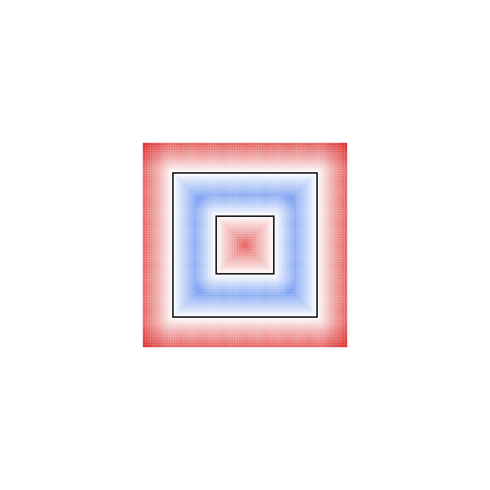
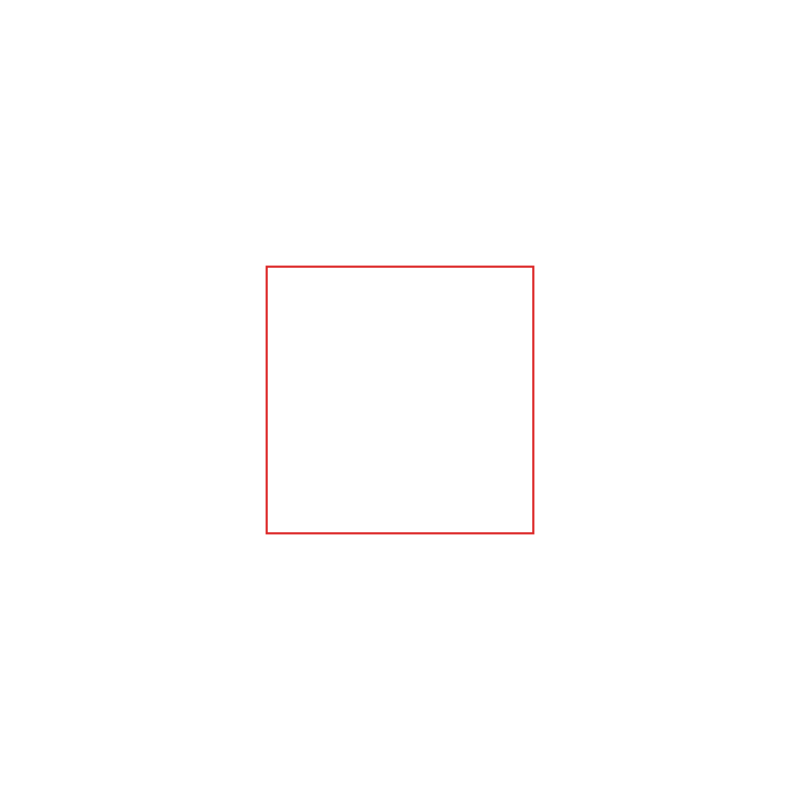
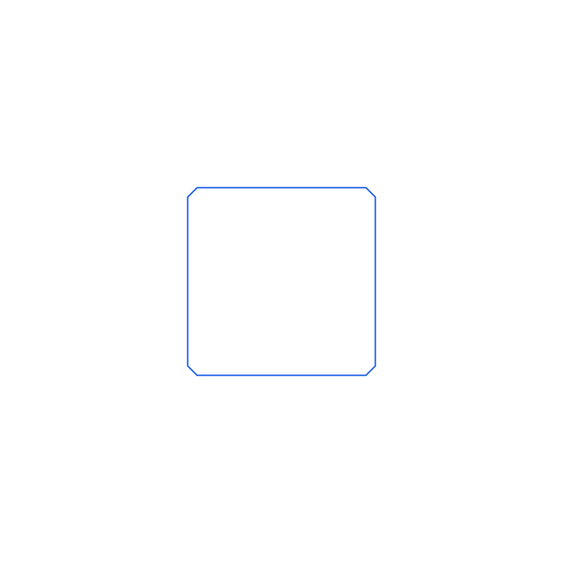

# levelset2d_polygon

A C++17 header-only library that reconstructs a `ns_cg::Polygon2d` from a
2D signed-distance level set (`ns_cg::Grid2d<double>`) via marching squares.
Combined with `common_geometry`'s `BuildLevelSet()`, this closes the round
trip: `Polygon2d` -> level set -> `Polygon2d`.

## Requirements

- CMake >= 3.20
- A C++17 compiler
- [Eigen3](https://eigen.tuxfamily.org/) (e.g. `brew install eigen` on macOS)
- A sibling checkout of [`common_geometry`](../common_geometry) at
  `../common_geometry` relative to this repository

## Building and testing

```sh
cmake -B build -DCMAKE_BUILD_TYPE=Debug
cmake --build build
cd build && ctest --output-on-failure
```

Note: because `common_geometry` is pulled in via `add_subdirectory`, `ctest`
also runs `common_geometry`'s own test suite alongside this project's.

## Usage

```cpp
#include "common_geometry/levelset.hpp"
#include "levelset2d_polygon/levelset2d_polygon.hpp"

ns_cg::Polygon2d ring(/* outer */ {...}, /* holes */ {{...}});
ns_cg::Grid2d<double> field = ns_cg::BuildLevelSet(ring, /*nx=*/81, /*ny=*/81,
                                                    /*padding=*/2.0);

std::vector<ns_cg::Polygon2d> reconstructed = ns_ls2p::ExtractPolygons(field);
// reconstructed[0].GetOuter() / .GetHoles() approximate the original ring.
```

See `examples/roundtrip_demo.cpp` for a runnable version, which also exports
both the original and reconstructed shapes to SVG (via `common_geometry`'s
`svg.hpp`) for visual comparison, plus `levelset_heatmap.svg`: the level
set itself rendered as a diverging-colormap heatmap (blue = inside, red =
outside) with the source polygon outlined on top, via `svg.hpp`'s
`ToSvg(const Grid2d<double>&, const Polygon2d&, ...)` overload.

Its output (regenerate with
`./build/examples/levelset2d_polygon_roundtrip_demo`):

| original | level set heatmap | reconstructed |
| --- | --- | --- |
|  |  |  |

## Algorithm

1. **`MarchCell`**: for each grid cell, classify its 4 corners as inside
   (value < 0) or outside based on the level set, and linearly interpolate
   the zero-crossing point along each edge where the sign changes. This
   yields 0-2 boundary segments per cell (16 standard marching-squares
   cases). Segments are oriented so inside is on the left of the direction
   of travel: outer contours trace CCW, holes CW.
2. **Saddle disambiguation**: the two cases where only diagonally-opposite
   corners are inside are ambiguous from the 4 corner samples alone (are
   the two inside corners connected through the cell center, or separate?).
   This is resolved using the average of the 4 corners as an approximation
   of the center value.
3. **`CollectSegments`** runs `MarchCell` over every cell. Segments from two
   cells sharing a grid edge always interpolate that edge's crossing from
   the same two corner samples in the same order, so shared endpoints are
   bit-identical -- linking needs no epsilon.
4. **`LinkIntoLoops`** links the segment soup into closed loops by
   following each vertex's unique outgoing segment (same technique as
   `rectilinear2d_boolean`'s boundary tracer).
5. Each loop's signed area (shoelace) classifies it as an outer boundary
   (positive/CCW) or a hole (negative/CW); each hole is attached to
   whichever outer polygon contains it (`ns_cg::PointInPolygon`).

### A pitfall this hit: exact/near-zero level-set samples

Early versions produced dozens of degenerate, near-zero-area loops instead
of one clean contour whenever the sampling grid happened to place a row (or
column) of nodes essentially *on* the polygon's boundary -- e.g. an
axis-aligned edge at a coordinate the grid spacing divides evenly. Two
compounding problems:

- `PointInPolygon`'s ray-casting test is numerically unstable for points
  essentially on an edge or vertex; neighboring samples a floating-point
  epsilon apart could get opposite inside/outside answers.
- A sample value of exactly (or extremely close to) 0 makes the edge
  interpolation `t = va / (va - vb)` land exactly on that grid point from
  *every* adjacent edge, producing zero-length segments.

`common_geometry::SignedDistanceToPolygon()` now floors near-boundary
magnitudes to a small positive constant (treating them as outside) instead
of returning a value near/at exactly 0, sidestepping both issues. See
`tests/test_marching_squares.cpp`'s
`OffCenterNonSquareHoleGridAlignedWithEdges` for the regression test.

### Limitations

Components that touch another component (or themselves) at a single point
are not supported and may produce an incorrect trace -- the same "bowtie"
caveat documented in `rectilinear2d_boolean`'s `ExtractContours()`.
Correctness beyond the hand-derived case table is validated empirically via
area-convergence tests on known shapes (square, ring, circle approximation)
rather than a formal proof.

**Marching squares cannot reproduce a sharp right-angle corner, at any
resolution.** Each grid cell only ever contributes straight segments, so a
90-degree corner is always replaced by a diagonal cut through whichever
cell it falls in, leaving two new vertices that are never actually 90
degrees. `analysis/corner_chamfer_analysis.cpp` (see below) measures this
directly.

| original (sharp corners) | reconstructed (chamfered corners) |
| --- | --- |
|  |  |

Regenerate with `./build/analysis/levelset2d_polygon_corner_chamfer_analysis`;
sample output (a 10x10 square, corner at the origin, coarsest vs. finest of
the tested resolutions -- the defect is well-known enough that two data
points make the point):

```
cells_across | cell_size | nearest vertex          | 2nd-nearest vertex
-------------+-----------+--------------------------+------------------------
           8 |    1.5000 | dist=  0.5000 angle=135.0000 | dist=  0.5000 angle=135.0000
         120 |    0.1000 | dist=  0.1000 angle=135.0000 | dist=  0.1000 angle=135.0000
```

The interior angle at both vertices flanking the cut stays pinned at 135
degrees (a 45-degree diagonal cut across a 90-degree corner) at both the
coarse and fine resolution -- refining the grid shrinks how far the cut
sits from the true corner, but never removes the angular defect itself.

## Directory layout

```
levelset2d_polygon/
├── include/levelset2d_polygon/  Public headers (header-only library)
├── examples/                    Runnable demo
├── analysis/                    Programs characterizing algorithmic behavior
│                                 (not usage examples), e.g. the corner-chamfer
│                                 measurement above
└── tests/                       GoogleTest unit tests
```
