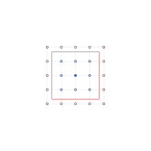
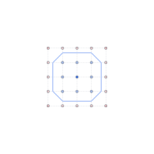
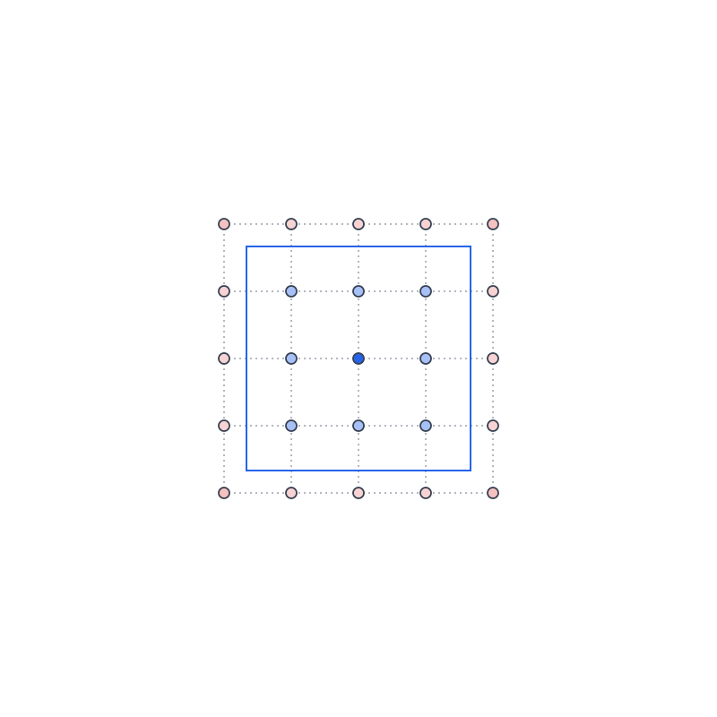
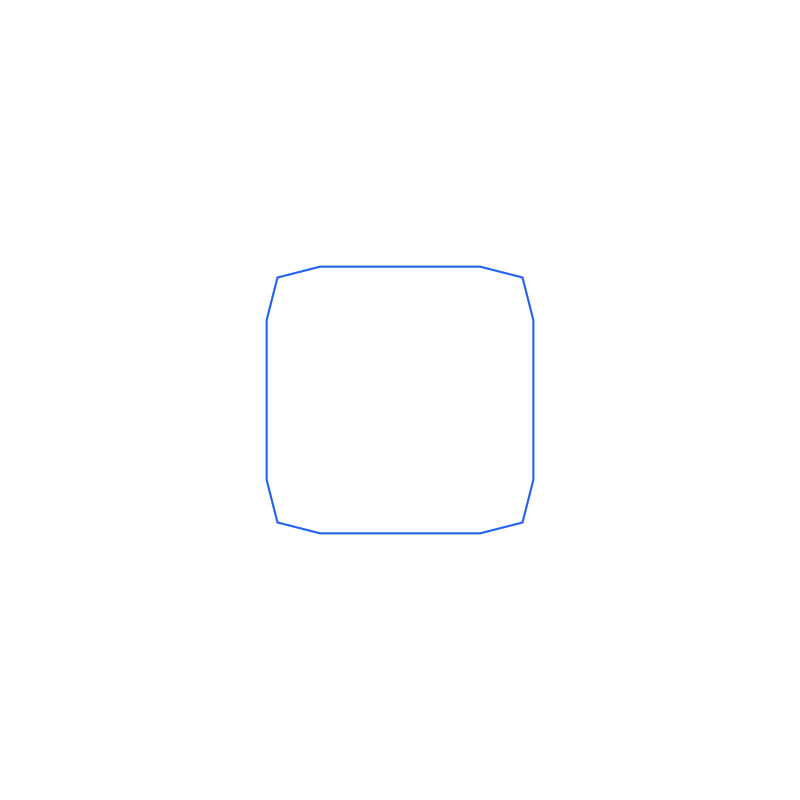
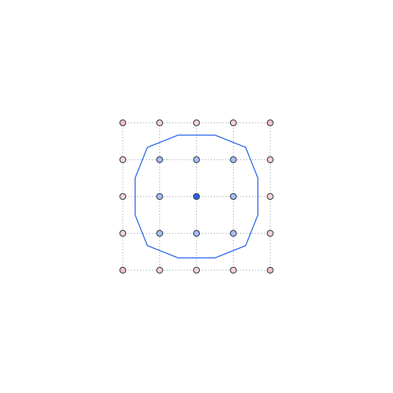
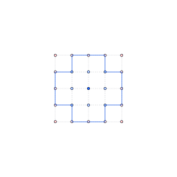

# levelset2d_polygon

A C++17 header-only library that reconstructs a `ns_cg::Polygon2d` from a
2D signed-distance level set (`ns_cg::Grid2d<double>`), via a choice of 5
extraction algorithms (marching squares, marching squares + corner
sharpening, dual contouring, surface nets, and rectilinear thresholding)
selected through a `PolygonExtractor` factory. Combined with
`common_geometry`'s `BuildLevelSet()`, this closes the round trip:
`Polygon2d` -> level set -> `Polygon2d`.

## Requirements

- CMake >= 3.20
- A C++17 compiler
- [Eigen3](https://eigen.tuxfamily.org/) (e.g. `brew install eigen` on macOS)
- A sibling checkout of [`common_geometry`](../common_geometry) at
  `../common_geometry` relative to this repository

## Building and testing

```sh
cmake -B build -DCMAKE_BUILD_TYPE=Debug
cmake --build build
cd build && ctest --output-on-failure
```

Note: because `common_geometry` is pulled in via `add_subdirectory`, `ctest`
also runs `common_geometry`'s own test suite alongside this project's.

## Usage

```cpp
#include "common_geometry/levelset.hpp"
#include "levelset2d_polygon/levelset2d_polygon.hpp"

ns_cg::Polygon2d ring(/* outer */ {...}, /* holes */ {{...}});
ns_cg::Grid2d<double> field = ns_cg::BuildLevelSet(ring, /*nx=*/81, /*ny=*/81,
                                                    /*padding=*/2.0);

std::vector<ns_cg::Polygon2d> reconstructed = ns_ls2p::ExtractPolygons(field);
// reconstructed[0].GetOuter() / .GetHoles() approximate the original ring.
```

See `examples/roundtrip_demo.cpp` for a runnable version, which also exports
both the original and reconstructed shapes to SVG (via `common_geometry`'s
`svg.hpp`) for visual comparison, plus `levelset_heatmap.svg`: the level
set itself rendered as a diverging-colormap heatmap (blue = inside, red =
outside) with the source polygon outlined on top, via `svg.hpp`'s
`ToSvg(const Grid2d<double>&, const Polygon2d&, ...)` overload.

Its output (regenerate with
`./build/examples/levelset2d_polygon_roundtrip_demo`):

Left to right: original, level set heatmap, reconstructed.

<table>
<tr>
<td align="center"></td>
<td align="center"></td>
<td align="center"></td>
</tr>
</table>

(Two things keep these -- and every comparison image below -- the same
size as each other on GitHub: their intended display size is baked
into the SVG file itself, via `SvgStyle::target_width_px`, since GitHub
does not reliably honor an `` tag's `width`/`height` override for
locally-referenced SVGs; and each image is the *only* content in its
table cell, since GitHub's table layout sizes a column to fit any text
sharing that column, which then squeezes a differently-sized image
into each column -- hence the caption living outside the table above,
not inline with each image.)

## Choosing an extraction method

`ExtractPolygons()` (used above) is always marching squares -- a direct,
dependency-free entry point for the common case. To choose a different
algorithm, go through the `PolygonExtractor` factory instead:

```cpp
#include "levelset2d_polygon/levelset2d_polygon.hpp"

std::unique_ptr<ns_ls2p::PolygonExtractor> extractor =
    ns_ls2p::CreatePolygonExtractor(ns_ls2p::ExtractionMethod::kDualContouring);
std::vector<ns_cg::Polygon2d> reconstructed = extractor->Extract(field);
```

| `ExtractionMethod` | What it does | Tradeoff |
| --- | --- | --- |
| `kMarchingSquares` | Interpolates the zero crossing linearly along each cell edge (see Algorithm below). | Simple and fast, but a right-angle corner is always cut by a single diagonal segment. |
| `kMarchingSquaresCornerSharpened` | Runs marching squares, then a post-process that detects vertex pairs shaped like a diagonal chamfer and collapses them back to the sharp corner their neighboring edges imply. | Cheap to add on top of marching squares; a heuristic, so it only helps shapes that actually have a chamfer-like angle pattern. |
| `kDualContouring` | Places each boundary vertex *inside* its cell (not on an edge), positioned via a least-squares fit (QEF) using the surface normal estimated from the field's gradient at each crossing. | Recovers sharp corners very well *once resolution is fine enough for the gradient estimate to be accurate near the corner*; needs gradient estimation and is more involved than marching squares. |
| `kSurfaceNets` | Like `kDualContouring`, places each vertex inside its cell rather than on an edge, but simply at the midpoint of the segment's two edge crossings -- no gradient/normal estimation at all. | No gradient estimation needed, simpler than dual contouring; moves the vertex closer to the true corner than marching squares, but (lacking normal information) its angle does not reliably converge to exactly 90 degrees the way dual contouring's does. |
| `kRectilinearThreshold` | Binarizes the field per cell (no interpolation at all) and traces axis-aligned cell boundaries -- the same technique `rectilinear2d_boolean` uses for its own occupancy grids, reimplemented locally here (Grid2d is already uniform, so no coordinate-compression step is needed, and no dependency on that project's private internals is taken). | Right angles come out exactly right at any resolution; diagonal or curved boundaries come out blocky/staircased instead of smooth, and the binarize threshold shrinks area at coarse resolution. |

See `analysis/corner_chamfer_analysis.cpp` below for a head-to-head comparison.

## Algorithm: marching squares

1. **`MarchCell`**: for each grid cell, classify its 4 corners as inside
   (value < 0) or outside based on the level set, and linearly interpolate
   the zero-crossing point along each edge where the sign changes. This
   yields 0-2 boundary segments per cell (16 standard marching-squares
   cases). Segments are oriented so inside is on the left of the direction
   of travel: outer contours trace CCW, holes CW.
2. **Saddle disambiguation**: the two cases where only diagonally-opposite
   corners are inside are ambiguous from the 4 corner samples alone (are
   the two inside corners connected through the cell center, or separate?).
   This is resolved using the average of the 4 corners as an approximation
   of the center value.
3. **`CollectSegments`** runs `MarchCell` over every cell. Segments from two
   cells sharing a grid edge always interpolate that edge's crossing from
   the same two corner samples in the same order, so shared endpoints are
   bit-identical -- linking needs no epsilon.
4. **`LinkIntoLoops`** links the segment soup into closed loops by
   following each vertex's unique outgoing segment (same technique as
   `rectilinear2d_boolean`'s boundary tracer).
5. Each loop's signed area (shoelace) classifies it as an outer boundary
   (positive/CCW) or a hole (negative/CW); each hole is attached to
   whichever outer polygon contains it (`ns_cg::PointInPolygon`).

**Pseudocode:**

```
function MarchCell(v00, v10, v11, v01, p00, p10, p11, p01):
    in00 = v00 < 0; in10 = v10 < 0; in11 = v11 < 0; in01 = v01 < 0
    case = in00 | in10<<1 | in11<<2 | in01<<3
    if case == 0 or case == 15: return []   # fully outside / fully inside

    B = Interpolate(p00, v00, p10, v10)     # bottom edge crossing
    R = Interpolate(p10, v10, p11, v11)     # right edge crossing
    T = Interpolate(p01, v01, p11, v11)     # top edge crossing
    L = Interpolate(p00, v00, p01, v01)     # left edge crossing

    if case in {5, 10}:                     # saddle: ambiguous from
        center = (v00 + v10 + v11 + v01) / 4   # corners alone
        return TwoSegmentsFor(case, center, B, R, T, L)
    return [LookupTable[case](B, R, T, L)]  # one of the other 12 cases

function Interpolate(pa, va, pb, vb):
    t = va / (va - vb)
    return pa + t * (pb - pa)               # zero crossing along a-b
```

**Diagram** (corner values: `v < 0` inside, `v >= 0` outside):

```
Case 1 -- only p00 inside:            Case 5 -- saddle (p00,p11 inside):

   p01 o───T───o p11                     p01 o───T───o p11
       │       │                             │  ╲ ╱  │
       L       R                             L   x   R   <- ambiguous:
       │       │                             │  ╱ ╲  │      resolved via
   p00 x───B───o p10                     p00 x───B───x p10  center average
  (inside)  (outside)                   segment: B->L, T->R
  segment: B -> L                       (or B->R, T->L -- picked by
  (inside kept on the left              whether center < 0)
   of the travel direction)
```

## Algorithm: dual contouring

Reuses marching squares' case table verbatim (same 16 cases, same saddle
disambiguation) to decide *which pairs* of edge crossings form each
boundary segment, and its already-validated `LinkIntoLoops`/`SignedArea`
to link segments into loops -- only the *vertex position* assigned to each
segment differs:

1. **`EstimateGradient`**: central-difference gradient at each grid node
   (one-sided at the boundary), an approximation of the outward surface
   normal (the sign convention -- negative inside -- makes the gradient
   point toward increasing/outside values naturally).
2. **`InterpolateNormal`**: for each edge crossing, linearly interpolates
   the two corner gradients using the same parameter `t` as the crossing's
   position, then normalizes -- an approximate normal *at* the crossing.
3. **`SolveQef`**: for a segment's two crossings `(p0,n0)`, `(p1,n1)`,
   solves the 2x2 least-squares system minimizing
   `sum_k (n_k . (x - p_k))^2`, placing the vertex where the two
   crossings' local tangent lines best agree -- which can be *inside* the
   cell, not confined to an edge. Falls back to the midpoint of `p0,p1` if
   the system is near-singular (near-parallel normals, i.e. the boundary is
   locally close to straight -- nothing sharp to resolve there anyway).
4. **`MarchCellDual`** mirrors `MarchCell`'s case switch, computing a
   `DualSegment` (the usual straight-line `Edge2d`, purely for linking, plus
   its `SolveQef`-placed vertex) for each segment instead of just the edge.
5. After linking (on the plain `Edge2d`s), each loop's edges are looked up
   in a `(start,end) -> dual vertex` map to build the final polygon.

This depends on gradient accuracy, which finite differences only estimate
well away from where the *true* gradient is discontinuous -- exactly at a
corner. See "Choosing an extraction method" above for how that plays out in
practice (very good once resolution is fine enough, less impressive at
coarse resolution).

**Pseudocode:**

```
function ExtractPolygonsDualContouring(field):
    gradients = EstimateGradients(field)        # central differences per node
    segments = []
    for each cell (i, j):
        for each edge-crossing pair MarchCell's case table selects:
            (p0, n0) = InterpolateNormal(edge_a, gradients)
            (p1, n1) = InterpolateNormal(edge_b, gradients)
            vertex = SolveQef(p0, n0, p1, n1)   # falls back to midpoint
            segments.append(DualSegment{edge: (p0, p1), vertex})
    loops = LinkIntoLoops([s.edge for s in segments])   # on the plain edges
    return BuildPolygonsFromDualVertices(loops, segments)

function SolveQef(p0, n0, p1, n1):
    # minimize sum_k (n_k . (x - p_k))^2 over x -- a 2x2 least-squares solve
    A = [n0; n1]                                # stack normals as rows
    b = [n0 . p0; n1 . p1]
    if det(A) is near 0:      # normals nearly parallel: boundary is
        return (p0 + p1) / 2  # locally ~straight, nothing sharp to resolve
    return solve(A, b)
```

**Diagram:**

```
Marching squares: vertex is        Dual contouring: vertex is pulled
constrained to a cell edge         inside, toward where the two
                                    crossings' tangent lines agree

   p01●───────●p11                    p01●───────●p11
      │      x│    x = edge              │   v   │   v = QEF(n0,n1),
      │      /│      crossing            │  ╱ ╲  │       inside the cell,
   p00●─────x─●p10                    p00●─┴───┴─●p10    closer to the
                                                            true corner
```

## Algorithm: surface nets

A simpler sibling of dual contouring, reusing the same case table,
`LinkIntoLoops`, and `SignedArea`, and differing only in vertex placement:
`MarchCellSurfaceNets` places each segment's vertex at the plain midpoint
of its two edge crossings (`0.5 * (a + b)`), with no gradient estimation or
QEF solve at all. This still pulls the vertex off the cell edge and closer
to a sharp feature than marching squares' edge-constrained placement, but
without normal information to orient it, the result doesn't converge to
the *exact* corner angle as resolution increases the way dual contouring's
does -- see the measured numbers in Limitations below (distance improves
at both resolutions tested; angle does not reliably approach 90 degrees).

**Pseudocode:**

```
function MarchCellSurfaceNets(v00, v10, v11, v01, p00, p10, p11, p01):
    # identical case/saddle logic to MarchCell -- same case index, same
    # center-average saddle disambiguation -- but each segment's vertex
    # is just the midpoint of its two crossings. No gradient, no QEF.
    for (a, b) in EdgeCrossingPairsFor(case, B, R, T, L):
        vertex = (a + b) / 2
        yield SurfaceNetsSegment{segment: (a, b), vertex}
```

**Diagram:**

```
Surface nets: vertex is the plain      Dual contouring: vertex pulled
midpoint of the 2 crossings            toward the tangent-line intersection
(no normals used)                      (normal-aware, closer to the corner)

   p01●───────●p11                        p01●───────●p11
      │  a╲   │                              │  a╲   │
      │    v  │   v = (a+b)/2                │   v   │   v = QEF(n0,n1)
      │   ╱  b│                              │  ╱  b │
   p00●──┴────●p10                        p00●─┴─────●p10
```

## Algorithm: rectilinear threshold

A cell is "inside" if the average of its 4 corner samples is negative (no
interpolation). From there it's the same occupancy-grid technique
`rectilinear2d_boolean` uses (reimplemented locally, since that project's
`detail::` internals aren't public API and `Grid2d` is already uniform so
the coordinate-compression step isn't needed here anyway): 4-connected
flood-fill labeling, axis-aligned boundary-edge collection tagged with
component id, loop linking, collinear-edge merging, and hole-to-outer
attachment via `PointInPolygon`.

**Pseudocode:**

```
function ExtractPolygonsRectilinearThreshold(field):
    for each cell (col, row):
        occupancy[col, row] = CellInside(field, col, row)  # avg of the
                                                             # 4 corners < 0
    return TraceRectilinearBoundary(occupancy, position_fn)

# TraceRectilinearBoundary (common_geometry, shared with
# rectilinear2d_boolean's occupancy-grid tracer):
#   1. LabelComponents: 4-connected flood fill over occupancy
#   2. CollectBoundaryEdges: axis-aligned edges between a filled and an
#      unfilled cell, tagged with their component id
#   3. LinkIntoLoops: chain edges into closed loops per component
#   4. SimplifyLoop: merge consecutive collinear edges
#   5. SignedArea: classify each loop as outer (CCW) or hole (CW);
#      attach holes to their outer polygon (AttachHolesByContainment)
```

**Diagram** (a diagonal boundary, binarized onto cells -- `■` = inside,
`·` = outside):

```
· · ■ ■        Every cell contributes only its own axis-aligned edges --
· ■ ■ ■        no interpolation -- so the traced boundary is a staircase
■ ■ ■ ·        along the true diagonal, with every right angle in the
■ ■ · ·        occupancy grid reproduced exactly.
```

## Algorithm: corner sharpening

A post-process over `ExtractPolygons()`'s output, not a new extraction
technique: `detail::SharpenCorners()` scans a loop's vertices for
consecutive pairs `B,C` whose interior angles are both within a tolerance
(default 5 degrees) of a target angle (default 135, marching squares'
characteristic chamfer angle). Where found, it computes where the
neighboring edges (`A->B` and `C->D`, extended) intersect, and replaces
`B,C` with that single point. Because it only fires on angle patterns that
look like a chamfer, it leaves loops without one (e.g. a smooth curve's
vertices) unchanged -- verified in
`tests/test_polygon_extractor.cpp`'s `CornerSharpenedAndDualContouringDoNotCorruptCircle`.

**Pseudocode:**

```
function SharpenCorners(loop, target_angle=135, tolerance=5):
    result = []
    for each consecutive vertex pair (B, C) in loop (..., A, B, C, D, ...):
        angle_B = InteriorAngle(A, B, C)
        angle_C = InteriorAngle(B, C, D)
        if |angle_B - target_angle| < tolerance
           and |angle_C - target_angle| < tolerance:
            P = LineIntersection(Line(A, B), Line(C, D))
            result.append(P)          # B, C collapsed to a single point
            skip C                    # don't re-emit it separately
        else:
            result.append(B)          # not a chamfer pair: keep as-is
    return result
```

**Diagram:**

```
Before (marching squares chamfer):     After (SharpenCorners):

  A                                      A
   ╲                                      ╲
    B────C   135°, 135°     ==>            P    P = Line(A,B) ∩ Line(C,D),
   ╱      ╲                                 ╲       the sharp corner B,C
  ·        D                                 D          implied

```

### A pitfall this hit: exact/near-zero level-set samples

Early versions produced dozens of degenerate, near-zero-area loops instead
of one clean contour whenever the sampling grid happened to place a row (or
column) of nodes essentially *on* the polygon's boundary -- e.g. an
axis-aligned edge at a coordinate the grid spacing divides evenly. Two
compounding problems:

- `PointInPolygon`'s ray-casting test is numerically unstable for points
  essentially on an edge or vertex; neighboring samples a floating-point
  epsilon apart could get opposite inside/outside answers.
- A sample value of exactly (or extremely close to) 0 makes the edge
  interpolation `t = va / (va - vb)` land exactly on that grid point from
  *every* adjacent edge, producing zero-length segments.

`common_geometry::SignedDistanceToPolygon()` now floors near-boundary
magnitudes to a small positive constant (treating them as outside) instead
of returning a value near/at exactly 0, sidestepping both issues. See
`tests/test_marching_squares.cpp`'s
`OffCenterNonSquareHoleGridAlignedWithEdges` for the regression test.

### Limitations

Components that touch another component (or themselves) at a single point
are not supported and may produce an incorrect trace -- the same "bowtie"
caveat documented in `rectilinear2d_boolean`'s `ExtractContours()`.
Correctness beyond the hand-derived case table is validated empirically via
area-convergence tests on known shapes (square, ring, circle approximation)
rather than a formal proof.

**Marching squares cannot reproduce a sharp right-angle corner, at any
resolution.** Each grid cell only ever contributes straight segments, so a
90-degree corner is always replaced by a diagonal cut through whichever
cell it falls in, leaving a vertex that's never actually 90 degrees.
`analysis/corner_chamfer_analysis.cpp` measures this for all 5 extraction
methods, at a coarse (4 cells across, i.e. a 5x5-point sampling grid) and
a fine (120 cells across, 121x121 points) resolution:

Left to right: original, MarchingSquares, CornerSharpened, DualContouring,
SurfaceNets, RectilinearThreshold.

<table>
<tr>
<td align="center"></td>
<td align="center"></td>
<td align="center"></td>
<td align="center"></td>
<td align="center"></td>
<td align="center"></td>
</tr>
</table>

(images above are the coarse-resolution reconstructions, deliberately at a
very coarse 4x4-cell grid so the differences between methods are obvious
at a glance)

Each image overlays the actual signed-distance level set every method is
reconstructing from at that resolution, via `svg.hpp`'s
`SvgStyle::heatmap_*` options: the 5x5-point sampling grid as a dotted
mesh (`heatmap_show_grid` + `heatmap_grid_dashed`, line thickness matching
the reconstructed polygon's own `stroke_width` so they read as one
consistent drawing), and each node pseudocolored by its signed-distance
value (`heatmap_show_points`; blue = inside, red = outside, white = zero;
`heatmap_fill_cells = false` keeps the cells themselves unfilled so the
mesh and points stay legible against the polygon outline). Every method
only ever sees these 25 sampled values -- not the square itself -- which
is why the corner reconstruction is only ever as good as what a 5x5
sampling of the level set can resolve.

Regenerate with `./build/analysis/levelset2d_polygon_corner_chamfer_analysis`;
measured output (a 10x10 square, corner at the origin -- distance and angle
of the reconstructed outer loop's vertex nearest that corner):

```
cells_across=4 (cell_size=3.0000)
  method                | nearest vertex distance | angle
  ----------------------+-------------------------+---------
  MarchingSquares        |                  2.0000 | 135.0000
  CornerSharpened        |                  0.0000 |  90.0000
  DualContouring         |                  0.5751 | 118.6357
  SurfaceNets            |                  1.4142 | 133.6028
  RectilinearThreshold   |                  2.2361 |  90.0000

cells_across=120 (cell_size=0.1000)
  method                | nearest vertex distance | angle
  ----------------------+-------------------------+---------
  MarchingSquares        |                  0.1000 | 135.0000
  CornerSharpened        |                  0.0000 |  90.0000
  DualContouring         |                  0.0000 |  90.0000
  SurfaceNets            |                  0.0707 | 143.1301
  RectilinearThreshold   |                  0.0000 |  90.0000
```

- **MarchingSquares** stays pinned at exactly 135 degrees at both
  resolutions -- refining the grid shrinks the cut, never its shape.
- **CornerSharpened** and **RectilinearThreshold** both recover the exact
  right angle even at the coarse resolution (for different reasons: one by
  detecting and undoing the chamfer, the other by never creating diagonal
  edges in the first place).
- **DualContouring** only closes in on exactly 90 degrees at the fine
  resolution -- at the coarse resolution its finite-difference gradient
  estimate near the corner's singularity isn't accurate enough to place the
  vertex perfectly (118.6 degrees here; how far off varies with exactly
  where the corner falls within its cell, so this number isn't necessarily
  monotonic across arbitrary resolutions -- see the git history of this
  file for a run that measured 149 degrees at a different coarse
  resolution). What *is* consistent: its vertex *position* is measurably
  closer to the true corner than marching squares' at every resolution
  tested (0.575 vs. 2.0 here), and it's the only method whose accuracy
  keeps improving as resolution increases rather than staying fixed.
- **SurfaceNets** also places its vertex closer to the true corner than
  marching squares at both resolutions (1.414 vs. 2.0 coarse, 0.071 vs.
  0.1 fine), but -- lacking any normal information to orient the
  placement -- its *angle* does not converge toward 90 degrees as
  resolution increases; it's actually further from 90 at the fine
  resolution (143.1 degrees) than at the coarse one (133.6 degrees). This
  is the key tradeoff versus dual contouring: cheaper and simpler, but no
  convergence guarantee on angle, only on position.

## Directory layout

```
levelset2d_polygon/
├── include/levelset2d_polygon/  Public headers (header-only library)
├── examples/                    Runnable demo
├── analysis/                    Programs characterizing algorithmic behavior
│                                 (not usage examples), e.g. the corner-chamfer
│                                 measurement above
└── tests/                       GoogleTest unit tests
```
